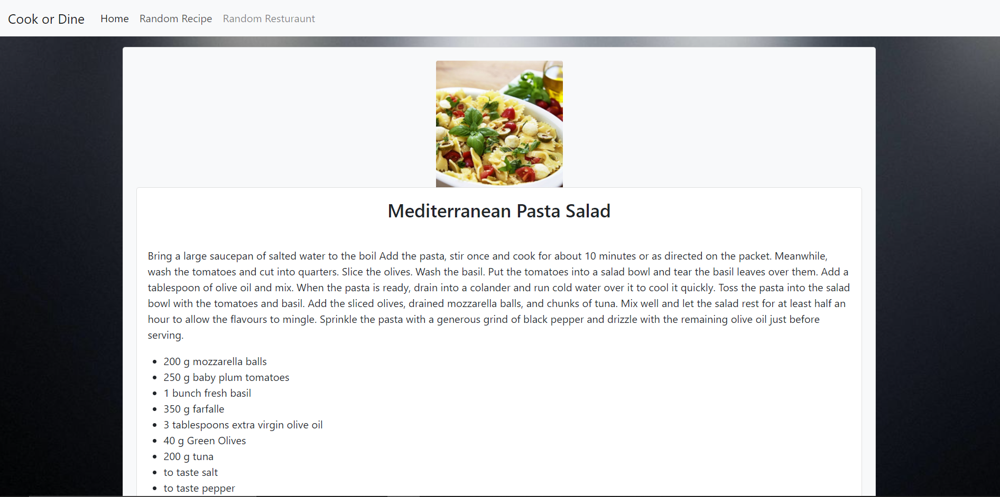
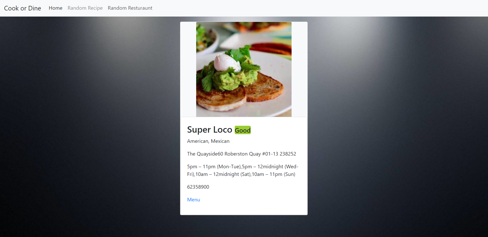

# Cook or Dine
- Repository link: https://github.com/greysonkirk/Project1
- Web App link: https://greysonkirk.github.io/Project1/

In life we have too many decisions to make and simplifying even just one decision can go a long way.
We have created an application to help you with one decision you make daily.
Cook or Dine is the app the makes your "what to eat" decision for you. By a flip of the coin, you either get to cook a cool recipe, or go out to eat at a restaurant in your area.
You know when you are just so busy with work or kids, you totally forget to think about what's for dinner? Well, Cook or Dine
is here to help! Cook or Dine is an application to choose whats for dinner for you. By simply flipping a coin, you will either
get a cool recipe to cook,or a restaurant to dine at in your area.
Not only is this app here to help with making a decision, it also makes seeing what is for lunch or dinner fun!
It's almost like food roulette.

The page will start by using “Flip Coin” to help decide if they should stay home and cook or dine out. If you land on heads, you will be given random cuisine recipes to choose from. If you land on tails, you will be able to look for restaurants within your location.

